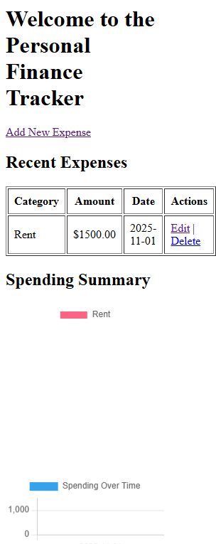

<p align="center">
  
</p>

# 💰 Personal Finance Tracker

A full-stack web application built with **Flask**, **SQLite**, and **Chart.js** that helps users manage, analyze, and visualize their daily expenses.

---

## ✨ Features

✅ **Expense Management** — Add, edit, and delete expenses directly from your browser  
📊 **Data Visualization** — Interactive Pie and Bar charts show spending by category and date  
💾 **SQLite Database** — Lightweight and persistent data storage  
🎨 **Simple UI** — Clean, extendable HTML/CSS design ready for custom styling  
⚙️ **Modular Code** — Separated logic for database, templates, and routes for easy maintenance  

---

## 🧠 Tech Stack

| Category | Tools Used |
|-----------|-------------|
| **Frontend** | HTML5, CSS3, Chart.js |
| **Backend** | Python (Flask Framework) |
| **Database** | SQLite |
| **Tools / Environment** | Git, VS Code, Virtual Environments |

---

## 🚀 Getting Started

### 1️⃣ Clone the repository
```bash
git clone https://github.com/nateKelley/FinanceTracker.git
cd FinanceTracker
